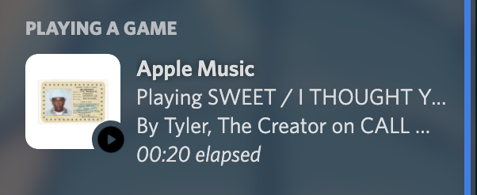
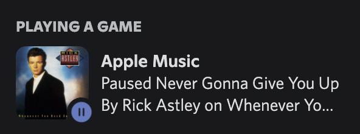

# AppleMusicRP - Apple Music Discord Rich Presence

**NOTE: Pre-Catalina macOS support should work but is not tested as I do not have access to an Intel Mac...**

A simple and light-weight menu bar application providing Discord Rich Presence support for Apple Music/iTunes on macOS and Windows!

## Highlights

- Light-weight (Uses only 0.5% CPU and less than 40MB of memory on 2020 M1 Macbook Air)
- Easy to install/use, all you need to do is run the app, no configuration required!
- Shows time elapsed (How far into the song you are)
- Status disappears after music is paused for >10 minutes and when no music is playing
- Universal Application (on macOS)
- Windows support

## Screenshots

### Screenshot while playing

### Screenshot while paused

## Usage

### Windows

- Download the latest version (in Releases) and run the installer (or extract the portable version)! 
- Run the application, which will be located either in `C:\Program Files\AppleMusicRP` or wherever u extracted the portable version. (Make sure Discord is running)
- That's it! You should now see a 🎵 icon in your system tray :)!

### macOS

- Download the latest version (in Releases), double click it, and move the .app "file" to your Applications folder (or wherever you wish.)
- Run it (Make sure Discord is running; If you get an "Unidentified Developer" error, alt+click the application and then click Open.)
- That's it! You should now see a 🎵 icon in your menu bar :)!

## Building

### Windows

`pip install wheel py2exe pypresence pyinstaller pywin32 psutil infi.systray dialite`

`.\build.bat`

### macOS

**If you want to build a universal application, make sure you are using [Python 3.9.x universal2 from Python's website](https://www.python.org/downloads/macos/) and not the homebrew version.**

`brew install create-dmg`

`python3 -m pip install wheel py2app rumps pypresence dialite`

`chmod +x ./build.zsh; ./build.zsh`

## Planned Features

- ~~Time elapsed~~ **DONE!**

- ~~Support for pre-10.15 macOS (Should be a simple change of `tell application "Music"` to `tell application "iTunes")~~ **DONE!**

- ~~Windows support~~ **DONE!**

- Anything else that is suggested and reasonable :)

## Acknowledgments

- [Rumps - Ridiculously Uncomplicated macOS Python Statusbar apps](https://github.com/jaredks/rumps)
- [pypresence](https://github.com/qwertyquerty/pypresence)
- [py2app](https://github.com/ronaldoussoren/py2app/)
- [create-dmg](https://github.com/create-dmg/create-dmg)
- [pywin32](https://github.com/mhammond/pywin32)
- [py2exe](https://www.py2exe.org/)
- [infi.systray](https://github.com/Infinidat/infi.systray)
  
## References

- [pypresence docs](https://qwertyquerty.github.io/pypresence/html/index.html)
- [Create a macOS Menu Bar App with Python](https://camillovisini.com/article/create-macos-menu-bar-app-pomodoro/#project-setup)
- <https://apple.stackexchange.com/questions/406941/applescript-and-music>

## Notice

iTunes, Apple, and Apple Music are registered trademarks of Apple Inc.
Discord is a registered trademark of Discord Inc.

This application is unofficial and was made for fun, it is not endorsed by Apple nor Discord.
