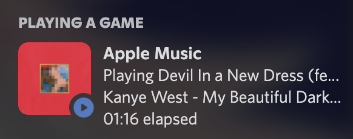

# AppleMusicRP - Discord Rich Presence for Apple Music

 

      

A simple and light-weight menu bar application providing Discord Rich Presence support for Apple Music/iTunes on macOS and Windows, **now with album art**!

## Highlights

- Easy to use
- Fetches and displays album artwork
- Shows time elapsed (How far into the song you are)
- Status disappears after music is paused for >10 minutes and when no music is playing
- Universal Application (on macOS)

## Download

### macOS
 
If you have homebrew installed, you can use this command to install AppleMusicRP:

`brew install wxllow/based/applemusicrp`

Otherwise, you can just download the latest DMG from the [releases](https://github.com/wxllow/applemusicrp/releases) tab

### Windows

The latest version is available from the [releases](https://github.com/wxllow/applemusicrp/releases) tab

## Usage

***If you get an "Unidentified Developer" error, alt+click the application and then click Open***

Make sure Discord is running and open the app!

## Building

***This section is for advanced users who want to build the app themselves!***

***If you are a normal user, ignore this.***

### macOS

***If you want to build a universal application, make sure you are using [Python 3 universal2 from Python's website](https://www.python.org/downloads/macos/) and not the homebrew version of Python!***

`brew install create-dmg`

`python3 -m pip install wheel py2app pystray pillow pypresence dialite coverpy appdirs toml`

`./build.zsh`

### Windows

***Make sure you're using Python from the Python website and not from the Microsoft Store!***

`pip install wheel py2exe pypresence pyinstaller pywin32 psutil pystray pillow dialite coverpy appdirs toml`

`.\build.bat`
  
## Credits

- [Material Icons](https://fonts.google.com/icons)
- [Coverpy](https://github.com/matteing/coverpy)
- [Pypresence](https://qwertyquerty.github.io/pypresence/html/index.html)
- [Everyone who has made issues/pull requests or has suggested improvements](https://github.com/wxllow/applemusicrp/issues)
- [And to all the dependencies that make this possible!](https://github.com/wxllow/applemusicrp/network/dependencies)

## License

The code of this project itself is licensed under the [MIT license](LICENSE). The logo and play/pause icons are licensed under the [Apache License 2.0](https://github.com/google/material-design-icons/blob/master/LICENSE). Dependencies used in this project have their respective licenses.

## Notice

iTunes, Apple, and Apple Music are registered trademarks of Apple Inc.
Discord is a registered trademark of Discord Inc.

This application is unofficial and was made for fun, it is not endorsed by Apple nor Discord.
